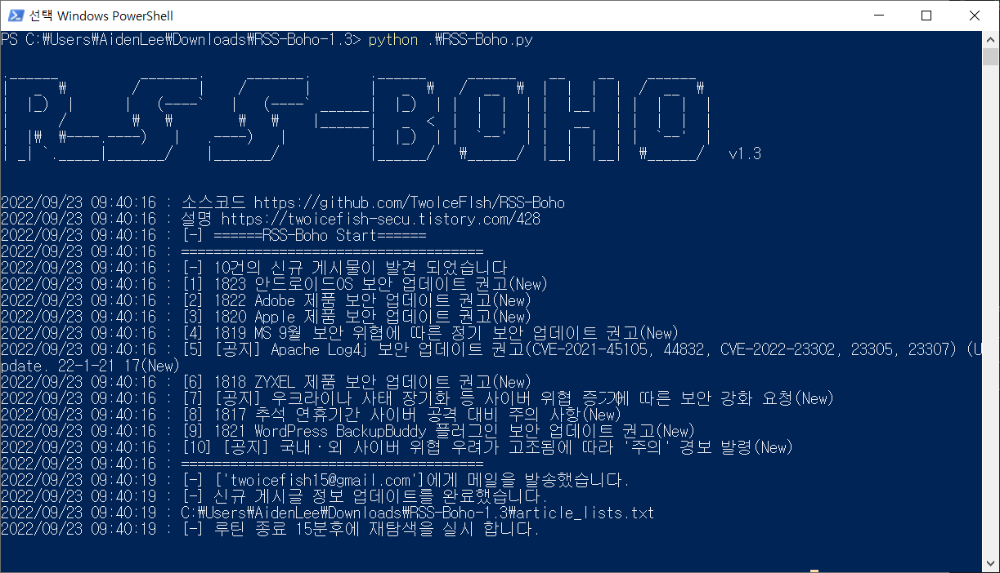

<p align="center"> </p> 

-----


### [프로그램 정보]
RSS-Boho 
+ KISA 인터넷 보호나라 신규 보안공지를 지정한 사람에게 메일로 발송할 수 있습니다

  * 깃허브 주소 : https://github.com/TwoIceFIsh/RSS-Boho

  * 다운로드 주소 : https://github.com/TwoIceFIsh/RSS-Boho/releases/latest
* 문의
  * Aiden Lee(team.k0konutz@gmail.com)
---
### [설치방법 - 기본]
```c
1. Google 2단계 인증 적용
2. Google 앱 비밀번호 발급
3. config.ini의 google_app_pw에 Google 앱 비밀번호 입력
4. config.ini의 google_gmail_id 에 앱 비밀번호를 발급밥은 Google Email 입력
5. mail_list.txt에 수신받을 메일 입력
6. RSS-Boho.exe 실행
```
---
### [설치방법 - 상세]

[twoicefsih-secu.tistory.com/428](https://twoicefish-secu.tistory.com/428)

---
### [프로그램 실행 화면]
1. 프로그램 실행 화면



2. 결과 수신 화면


---

### **[에러메시지]**

```c
# 최초 실행 시 새로운 파일 생성 세팅이 필요
[-] 새로운 설정 파일이 생성 되었습니다.
[-] 설정 후 실행해 주세요.

# config.ini 파일의 세팅값 변경 필요
[!] 자신만의 설정값으로 변경해 주세요

# mail_list.txt에서 이메일 주소 확인
[!] {i} 올바른 이메일 형식이 아닙니다. 확인해 주세요
또는
[!] 이메일 리스트가 비어 있습니다. 추가해주세요

# config.ini파일 에서 Google App PW 및 Google ID 확인
[!] Google ID 및 Google API PW를 일치하지 않거나 존재하지 않습니다 확인해 주세요
```

---
### **[무설치 버전]**

메일주소만 입력하여 회신받을 수 있습니다.

https://www.kokonut.today/mail

---